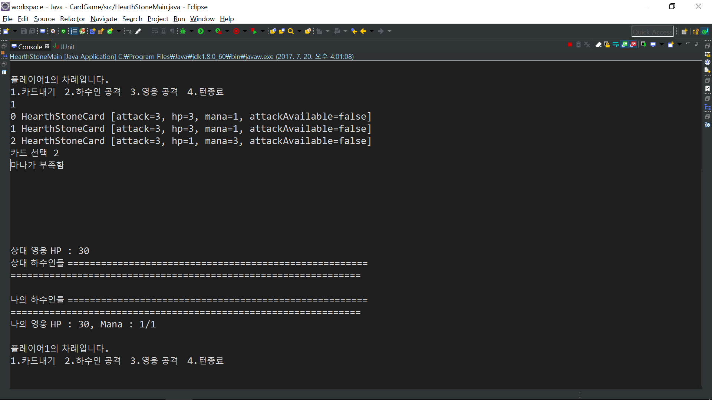
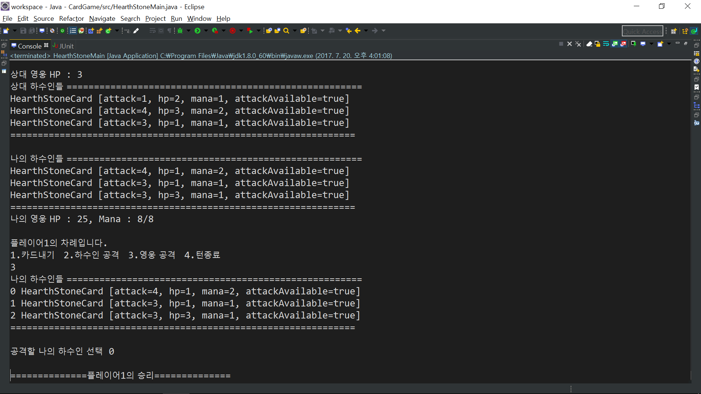

#하스스톤게임 api 구현하기
***
사용 언어 : java

배틀 형식의 카드게임에서 공통적이라 생각한 기능은 인터페이스로 생성합니다. 
인터페이스를 구현한 클래스에서 하스스톤의 기능을 추가하여 구현합니다.
***

###게임의 모든 기능을 구현하지 않고, 아래와 같은 기능을 구현 합니다.
 * 플레이어는 카드 덱에서 카드를 뽑아 손에 추가
 * 플레이어는 카드를 낼 때 마나를 사용
 * 플레이어가 카드를 내면 하수인에 등록
 * 플레이어는 하수인으로 상대의 하수인과 영웅을 공격
 * 직전에 추가된 하수인과 한번 공격한 하수인은 공격 불가
 * 플레이어의 영웅체력이 0이하가 되면 게임 종료
***

### [src/card/HearthStoneCard.java](https://github.com/berlizz/card-game-api/blob/master/src/card/HearthStoneCard.java)
 * 카드는 체력, 마나, 공격력, 공격가능여부를 기본으로 설정
 * 하수인으로서 공격을 받을 시 공격력만큼 체력이 감소
 * 체력이 0이하가 될 시 소멸
***

### [src/carddeck/HearthStoneCardDeck.java](https://github.com/berlizz/card-game-api/blob/master/src/carddeck/HearthStoneCardDeck.java)
 * 카드 덱은 30장의 카드를 생성
 * 생성된 카드를 섞은 뒤 스택에 저장
 * 카드 뽑기 요청을 받을 시 스택에서 카드 하나 반환
***

### [src/player/HearthStonePlayer.java](https://github.com/berlizz/card-game-api/blob/master/src/player/HearthStonePlayer.java)
 * 플레이어는 영웅의 체력(30), 마나, 보유카드, 하수인들, 카드 덱을 기본으로 설정
 * 카드 뽑기, 카드 내기, 턴 종료, 상대 하수인 공격, 
상대 영웅 공격 수행
 * 카드 내기, 상대 하수인 공격, 상대 영웅 공격, 턴 종료는 사용자가 입력한 명령으로 선택되어 수행
 * 턴 종료 시 카드 뽑기, 마나 회복, 하수인 공격 설정 수행
***

### [src/game/HearthStoneGame.java](https://github.com/berlizz/card-game-api/tree/master/src/game)
 * 게임은 두명의 플레이어를 생성
 * 두명의 플레이어는 턴제로 게임 플레이
 * 사용자로부터 입력받은 명령을 플레이어로 요청
 * 두명의 플레이어 중 한명의 체력이 0이하가 될 시 게임 종료
***

### [src/HearthStoneMain.java](https://github.com/berlizz/card-game-api/blob/master/src/HearthStoneMain.java)
 * 게임 실행
***

### 게임 실행 화면

